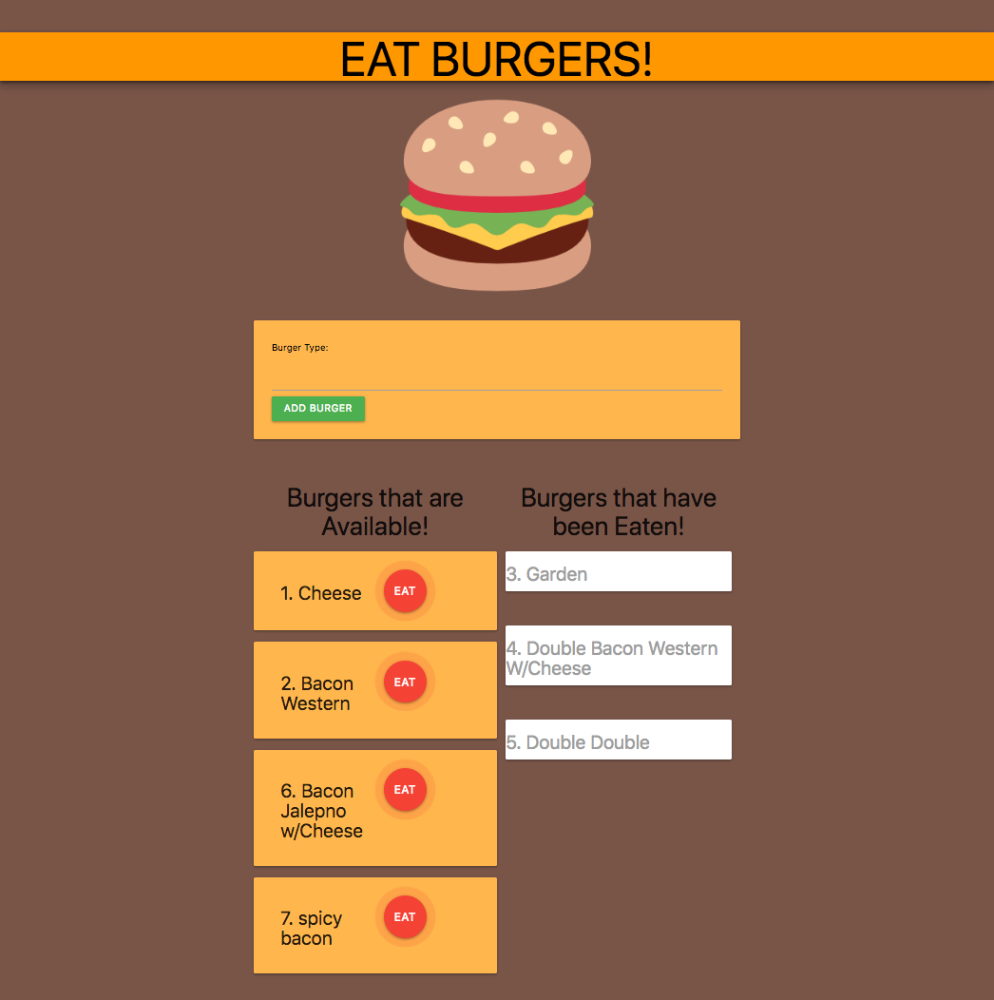
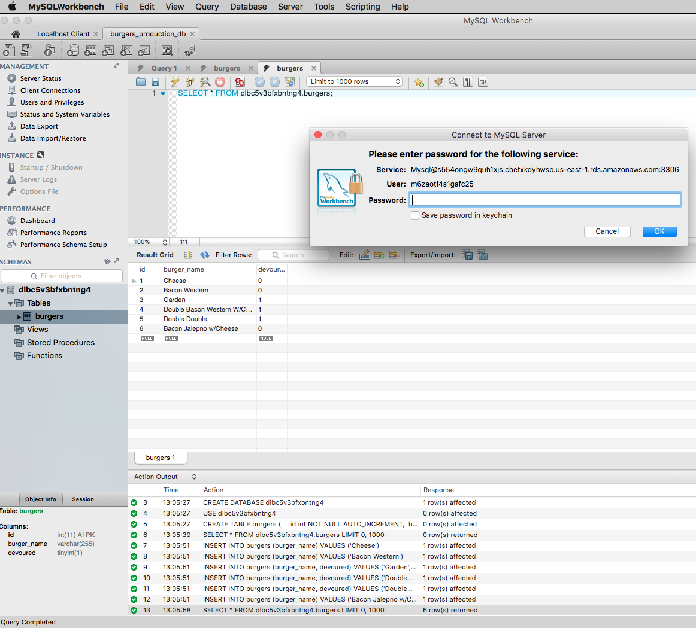

# Eat Burgers!
This application allows users to create burgers, eat burgers, and view all burgers previously eaten. 

This application uses an ORM inside of an MVC framework to handle user interaction and data management. 

## This application utilizes:
- [Node.js](https://nodejs.org/en/)
- [Express](https://expressjs.com/)
- [Handlebars](https://handlebarsjs.com/)
- MySQL(https://www.mysql.com/)
- [jQuery](http://jquery.com/)
- [Materialize](http://materializecss.com/)
- Heroku w/[JawsDB](https://elements.heroku.com/addons/jawsdb)

